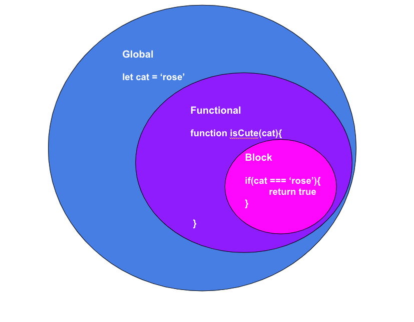
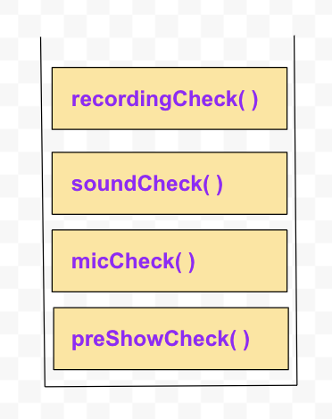

# Functions and Variables in JS
## Objectives
- Debug the code
    - Use the browser console to test code
    - Demonstrate Console.log
    - Know how to look up the other console methods 
    - Demonstrate Debugger 
- Demonstrate a strong understanding of JavaScript functions
    - Define functions as First-class functions 
    - Invoke functions 
    - Define parameters and pass arguments 
- Declare Variables and understand scope of a variable
    - Demonstrate Function Scope
    - Demonstrate Block Scope
    - Demonstrate Lexical Scope
    - Understand Hoisting and Context
- Understand the call stack 
    - Explain Execution Context 


## JavaScript First-class Functions  
JavaScript functions are considered First-class functions because they can be assigned to a variable as a value, passed as arguments, be returned functions, stored in other data structures and have properties and methods.

## Higher-order Functions  
Functions that accept other functions as arguments and/or return a function are Higher-Order functions

## Context
 - global: Code that's not inside any functions.  
    - Code that is global can not access code inside of functions 
 - function: Code that is inside a function. 
    - A function can have access to the code inside of it and the code in the global context
 
## Scope 
Scope refers to what context our code has and determines what variables we have access to.

```
//Scope 
    //host is in global Scope 
let host = 'Rose'

function recordShow(){
    //epName is in functional scope  
    let epName = 'ep2. JavaScript Scope'
    console.log(`${epName} with ${host}`)
}

recordShow()
console.log(host)
console.log(epName)
// Uncaught ReferenceError: epName is not defined

    // We can access host in both functional and global scope
    // But we can't access epName in the global scope
    // Variables in functional scope are only available in the area they are defined
    
if('cat'=='cat'){
    //this is block scope
    var cookie = 'peanut butter'
    let cookie2 = 'snickerdoodle'
} 
    // Unlike functional scope, a variable defined with var in block scope can be accessed in the global scope 
    // This makes it easy to accidentally code in bugs such as using or assign variables with the incorrect values
    // Because of this we want to avoid using var and use lets in its place 
console.log(cookie)
console.log(cookie2)
// Uncaught ReferenceError: cookie2 is not defined


```





## Hoisting 
JavaScript Programs are processed in at least two phases. 
- Parsing   
    The code is parsed/read from top to bottom, at this point, it will throw syntax errors if it finds them. 
- Execution
    In the second phase, the code is executed, functions will run if they were invoked.
    This allows for Hoisting 
     - Because of the parsing phase, a variable can be used before it's declared.
     - Functions can also be invoked before they are declared
     - Variables declared with let and const are not hoisted 
```
//used here
cat = 'rose'

console.log('cat')

// declared here
var cat 

//invoked here 
foo()

// declared here
function foo(){
    console.log('hi rose')
}

// Uncaught ReferenceError: Cannot access 'dog' before initialization
dog = 'tod'
console.log(dog)
let dog 

```

## The Call Stack
The call stack is like a list that keeps track of function calls. The order it runs in is based on the First in Last out principle. 
When a function is invoked it's added to the call stack. When the function is returned it is removed from the stack.

```
function preShowCheck(){
    console.log('begin pre-show check')
    micCheck()
    console.log('done with preShowCheck')
    return
}

function micCheck(){
    console.log('testing one two three')
    soundCheck()
    console.log('done with mic Check')
    return
}

function soundCheck(){
    console.log('can you hear the beep?')
    recordingCheck()
    console.log('done with sound check')
    return
}

function recordingCheck(){
    console.log('playing back recording... sounds like everything is fine')
    console.log('done with recording check')
    return
}

preShowCheck()
```




## References 
[The JS Call Stack Explained in 9 Minutes](https://www.youtube.com/watch?v=W8AeMrVtFLY)
[What Makes JavaScript Weird and Awesome](https://www.youtube.com/watch?v=SBwoFkRjZvE)
[Higher-Order-Functions](https://eloquentjavascript.net/05_higher_order.html)
[You Don't know JS Yet: Scope & Closures](https://github.com/getify/You-Dont-Know-JS/tree/2nd-ed/scope-closures)

