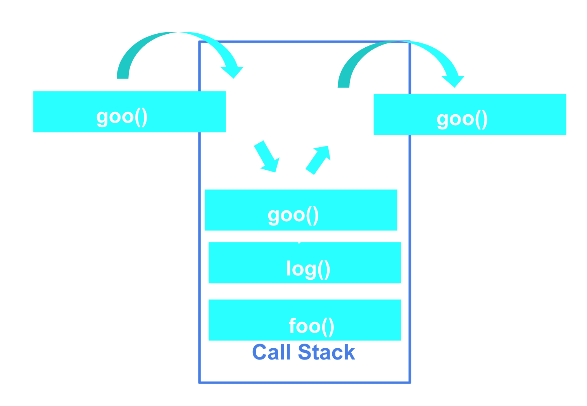
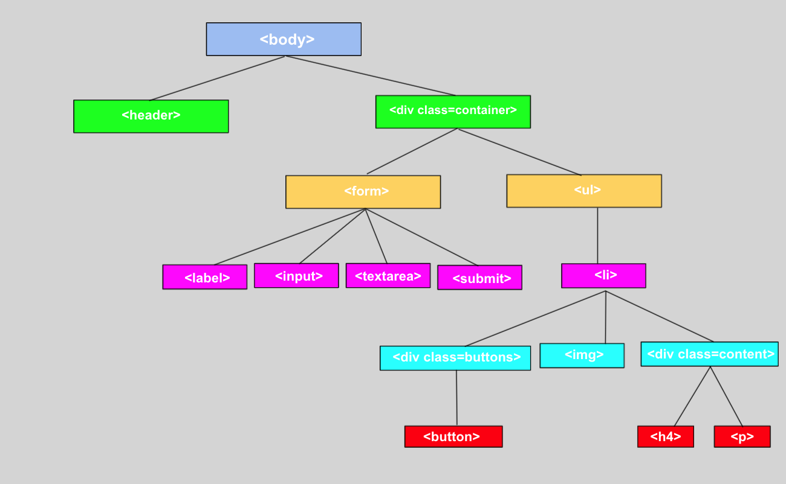

# Data Structures 
## SWBAT

- Use different Data Structure in JS
    - Array
    - Objects 

- Access and iterate through different Data Structure
    - Arrays
        - Index in array
        - Access single element in array and objects
        - for…of
    - Objects
        - dot notation 
        - bracket notation
        - Object.keys()
        - Object.values()
        - Object.entries()
        - Iterate through Object
     
        
- Demonstrate a strong understanding of JavaScript functions
    - Define functions as First-class functions 
    - Invoke functions 
    - Define parameters and pass arguments 
    - forEach
    - map
    - find/filter

## Data Structures 



```
//Arrays
[1,2,3,4]


//Objects/Hashes
{name:'rose', age:9}

```


## JavaScript First-class Functions  
JavaScript functions are considered First-class functions because they can be assigned to a variable as a value, passed as arguments, be returned functions, stored in other data structures and have properties and methods.

## Higher-order Functions  
Functions that accept other functions as arguments and/or return a function are Higher-Order functions

## Accessing