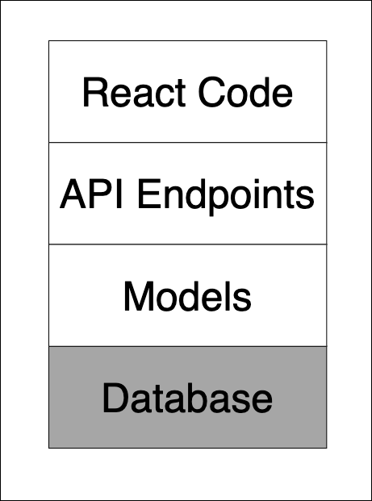
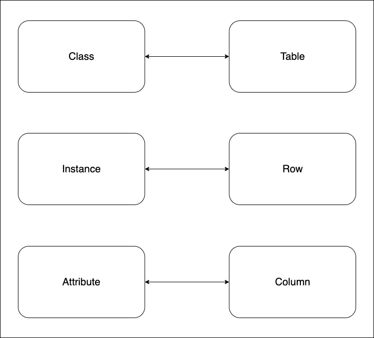

# Intro to Databases

## Part 1 - Databases

- We've learned about OO Ruby, and how it helps us model real world situations.
- For homework, we learned about SQL and how we can use it to interact with a database
- what's missing is a deeper understanding of the structure and characteristics of a database and how it can support a modern web application.
- Today, we'll focus on how Databases fit into the larger context of your learning journey
  - how they relate to what you've learned so far
  - and how we'll build on them moving forward



Our focus today is to understand how the structure of our database can support features that we want to build.

### The Problem - Dive into ./bin/console and interact with dogs

We have a few dogs created within the `dog.rb` file:

```rb
@lennon = Dog.new(name:"Lennon Snow", age: "11 months", breed: "Pomeranian")
@olivia = Dog.new(name: "Olivia", age: "3 years", breed: "Terrier")
@chop = Dog.new(name: "Chop", age: "1 year", breed: "German Shorthaired Pointer")
@baron = Dog.new(name: "Baron", age: "8 years", breed: "GSD/English Lab mix")

```

Let's open up `./bin/console`, save `@chop` and then check out `Dog.all`

Now exit `./bin/console` and check out `Dog.all` again.

Why might this be a problem? Let’s say you’re working for Facebook and a user creates an instance of a profile. What problem do you see with the fact that the program will need to rerun the code in order for the user to continue to access that profile every time they enter the app? 

If the data is not persisted, then our users will have to do everything from scratch.
...

Labs have introduced the idea of rows and columns within a database table and we've also introduced SQL, but we haven't discussed how the structure and characteristics of a database support our application code.

So, let's start taking a look at that structure by opening up [Google Sheets](https://docs.google.com/spreadsheets/d/1XV8ixdHveb2Z5aOMQknPdsNCNmo3JZvXX4criCrNXAo/edit#gid=0)


### Activity

**Make your own copy of the [sheet]((https://docs.google.com/spreadsheets/d/1XV8ixdHveb2Z5aOMQknPdsNCNmo3JZvXX4criCrNXAo/edit#gid=0)) so that you can fill in the column names and types for the exercises.**
- Take a look at the Dog class in our code and based on that, fill in your sheet with the columns (and types) you think we should add to the dogs table.
- I'll set a timer for 1 minute 
- After the timer is up, copy the top row of your table with the column names from your sheet and paste it into the Zoom chat when I say "Go!".


Why did we choose the types that we did here?

### Wrap up part 1:
- Basic Analogy between Object Oriented code and Databases
- Benefits and challenges introduced by databases


## Part 2 - Relational Databases and the One to Many Relationship

- Related data
  - A Post and its comments
  - A Doctor and its appointments
  - A Dog and its walks
  - A Computer and its issues
- Single Source of Truth
- Primary and Foreign Keys

**Key Takeaway**: All database relationships require a foreign key - primary key relationship. The foreign key always goes in the table associated with a single row in the other table.


### Activity

Say we want to build an application for doctors to keep track of their patients.
- Think about what columns each table should have and what type they should be. Take a few minutes to fill them into the sheet.
- I’m going to set a timer for 3 minutes and when it’s done, I’ll ask you to copy your answer from the spreadsheet into the spreadsheet when I say go:

Doctors: column1 (type) column2 (type) column3 (type)

Patients: column1 (type) column2 (type) column3 (type)

After we get answers, I’ll fill them into our spreadsheet and we’ll discuss briefly and take a break


## Part 3 - The Many to Many Relationship

### Activity

Introduce appointments into the picture here so we can keep track of appointments with multiple doctors and multiple patients.

- Think about what columns each table should have and what type they should be. 
- I’m going to set a timer for 3 minutes and when it’s done, I’ll ask you to copy your answer from the spreadsheet into the spreadsheet when I say go:

Doctors: column_1 (type) column_2 (type) column_3 (type)

Patients: column_1 (type) column_2 (type) column_3 (type)

Appointments: column_1 (type) column_2 (type) column_3 (type)

After we get answers, I’ll fill them into our spreadsheet and we’ll discuss briefly and take a break
