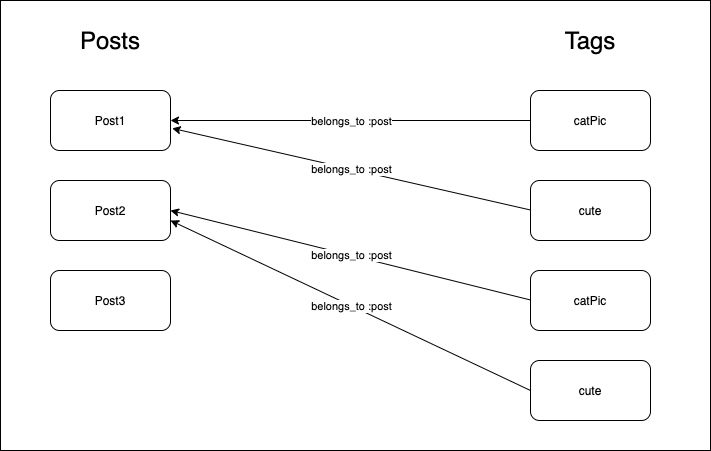

# ActiveRecord Associations - Many to Many

### Learning Goals:
- [] Make the connection between database schema and `ActiveRecord` relationships
- [] Implement a many to many association between two models
- [] Understand the many to many pattern
- [] Read and understand documentation on ActiveRecord association methods

---

Part 1 - Understand Many to Many pattern and apply it to Patient Tracking Application (with me)
Part 2 - Apply Many to Many pattern to Dog walking application
Part 3 - Use association methods in the console to create relationships between instances

## Important Resources for Today
- [Reference guide for migrations to update existing tables](https://api.rubyonrails.org/v5.2.6/classes/ActiveRecord/ConnectionAdapters/SchemaStatements.html)
- [Reference guide for creating new tables (what you can do with the |t|)](https://api.rubyonrails.org/v5.2.6/classes/ActiveRecord/ConnectionAdapters/TableDefinition.html)
- [RailsGuides on ActiveRecord](https://guides.rubyonrails.org/v5.2/active_record_basics.html)
- [RailsGuides on ActiveRecord Migrations](https://guides.rubyonrails.org/v5.2/active_record_migrations.html)
- [RailsGuides for ActiveRecord Query Interface](https://guides.rubyonrails.org/v5.2/active_record_querying.html)
- [RailsGuides for ActiveRecord Associations](https://guides.rubyonrails.org/v5.2/association_basics.html)
- [Rails documentation (section on ActiveRecord)](https://api.rubyonrails.org/v5.2.6/)
- [APIDock has_many](https://apidock.com/rails/ActiveRecord/Associations/ClassMethods/has_many)
- [APIDock belongs_to](https://apidock.com/rails/v5.2.3/ActiveRecord/Associations/ClassMethods/belongs_to)
- [VSCode Sqlite Extension](https://marketplace.visualstudio.com/items?itemName=alexcvzz.vscode-sqlite)

## Topics

### What is the difference between a one to many relationship and a many to many relationship?





...
## Help me build this out

Say we want our Patient Tracker application to be able to handle the situation where our office has multiple doctors that patients can book appointments with. In this case, we'll have to consider the following questions:
1. how will our database have to change?
2. how will our models have to change?

- Make sure our database tables are set up to support the relationships we need
- Create a many to many relationship between `Doctor` and `Patient` through `Appointment`
- run `rake db:seed` to create some seed data
- open up `./bin/console` and create a couple of Doctors and add appointments to them

```rb
@drew = Doctor.find_or_create_by(name: "Dr. Drew", specialization: "Addiction Medicine", hospital: "TV")
@phil = Doctor.find_or_create_by(name: "Dr. Phil", specialization: "Psychology", hospital: "TV")

# make appointments with this doctor and try out association methods 
```

### Discussion Questions
#### How many macros are involved in implementing the many to many relationship and where do they go? 

...

#### What is a join model? Which of the 3 classes we defined here is a join model?

...


## Segment 2 - Task: Apply has_many, through

For our dog walking tracking application, we want to allow multiple doctors to work in the same office. Our users should be able to:


To do that, we'll discovered that we actually need to set up a many to many relationship and utilize the `has_many, through` macro. We'll also need to make sure that our database can support these relationships.
To start, there will only be the patients table created for you, so you'll need to add migrations for the 2 other required tables: `dog_walks` and `walks`, the required columns and types are visible in the test file:

1. Create dog_walks table with appropriate columns
2. Create walks table with appropriate columns
3. add association macros for each to ensure associations are set up properly.
4. Run `rspec` until all tests are passing
If you have extra time, you can uncomment the specs at the bottom of `spec/01_dog_walker_spec.rb` and work on those.

## Segment 3 - Interacting with Association methods via the console

5. run `rake db:seed`
6. Enter `./bin/console` and interact with the `Dog` and `Walk` classes, try taking dogs on walks, how do you mark that a dog pooped on a walk? 

### When you take a dog on a walk, which table do you add a row to?


## Key Takeaways

If you can avoid mistakes in database design by drawing a diagram and thinking about relationships and foreign keys up front, it will save you lots  of headaches. 
- rolling back migrations can be tricky
- new migrations to change existing tables require different methods and syntax
- methods for adding/removing foreign keys with ActiveRecord migrations (v5.2) and Sqlite don't work requiring a bunch of extra work
### Different Ways to Add Foreign key to table

`belongs_to` and `references` are aliases of the same method. Both of them add the integer column and an index on the table for it (to speed up queries). Neither of them adds the foreign key constraint by default, so we pass that as a second option.

```rb
create_table :appointments do |t|
  t.belongs_to :doctor, foreign_key: true
end
# same as
create_table :appointments do |t|
  t.references :doctor, foreign_key: true
end
```

### Advanced Details

However, in the next couple of weeks, we'll be using ActiveRecord 5.2 (as it's the newest version that plays nice with Sinatra) and the `add_foreign_key` and `remove_foreign_key` methods (which are used in migrations that update existing tables) don't work with `sqlite3`. So if we need to add a foreign key to an existing table, we actually need to revert the previous migration and use the `create_table` syntax again (which works with AR 5.2 to allow adding foreign key constraints). There is a nice way of doing this within a migration, however, so you won't need to rollback a ton of migrations manually and potentially affect a lot of other parts of the database in the process. 


#### Change migrations
```rb
class AddDoctorIdToAppointments < ActiveRecord::Migration[5.2]
  def change
    revert CreateAppointments # CreateAppoinments is the class name of the migration that originally created the table
    # note here that all of the appointments in our table will be lost when we do this migration
    create_table :appointments do |t|
      t.datetime :starts_at
      t.belongs_to :patient, foreign_key: true
      t.belongs_to :doctor, foreign_key: true
      t.text :notes
      t.boolean :no_show

      t.timestamps
    end
  end
end

```

Note, if we revert the previous migration, that will drop the table, removing any data that we previously had. If we're early on in the process and we don't have a bunch of data in the table already, this is fine.But, if we've been working for a while and already have a bunch of data that we don't have an easy way of recreating (via seeds for example) we may want to keep the existing data. To do that, we'd need to do an `up` `down` style migration so we can first deleting all the data from the table (and store it) before dropping the table and then once we create it again with the proper constraint we can populate the data to the newly created table.


```rb
require_relative '20210817055048_create_appointments'

class AddDoctorIdToAppointments < ActiveRecord::Migration[5.2]
  def up
    appointments = Appointment.destroy_all
    revert CreateAppointments
    create_table :appointments do |t|
      t.datetime :starts_at
      t.belongs_to :patient, foreign_key: true
      t.belongs_to :doctor, foreign_key: true
      t.text :notes
      t.boolean :no_show
    end
    appointments.each{|appt| Appointment.new(appt.attributes).save}
  end

  def down
    appointments = Appointment.destroy_all
    drop_table :appointments
    create_table :appointments do |t|
      t.datetime :starts_at
      t.belongs_to :patient, foreign_key: true
      t.text :notes
      t.boolean :no_show
    end
    appointments.each{|appt| Appointment.new(appt.attributes.filter{|k,v| k != "doctor_id"}).save}
  end
end
```

The way `up` and `down` work here is that `up` runs when you execute `rake db:migrate` and `down` runs when you run `rake db:rollback`. So, we're filtering out the doctor_id from the attributes within the `down` migration, because reverting the migration will remove the doctor_id column from the table, and leaving it in when creating a new Appointment would trigger an error.

```rb
create_table :walks do |t|
  t.datetime :time
end

create_table :dog_walks do |t|
  t.belongs_to :dog, foreign_key: true
  t.belongs_to :walks, foreign_key: true
  t.boolean :pooped, default: false
end

create_table :dogs do |t|
  t.string :name
  t.date :birthdate
  t.string :breed
  t.string :image_url
  t.datetime :last_pooped_at
end

create_table :patients do |t|
  t.string :name
  t.datetime :last_visited_on
  t.date :birthday
  t.string :insurance_provider
  t.boolean :is_insured
  t.boolean :is_alive
  t.boolean :is_organ_donor
end

create_table :appointments do |t|
  t.datetime :starts_at
  t.belongs_to :patient, foreign_key: true
  t.belongs_to :doctor, foreign_key: true
  t.text :notes
  t.boolean :no_show
end

create_table :doctors do |t|
  t.string :name
  t.string :specialization
  t.string :hospital
  t.boolean :gives_lollipop
end

```