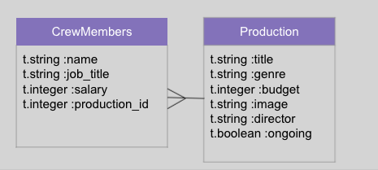

# Phase-2-Client/Server Communication 1

## SWBAT
- [ ] Explain the client-server relationship 
- [ ] Use postman to test rails routes 
- [ ] Build CUD with a one to many relationship
- [ ] Use Strong Params to have secure mass assignment
- [ ] Configure errors  


### What are we making?


### The backend
* Should have 2 models 
* CrewMembers > Productions


**Routs**  
`GET /Productions :` Should return a collection of cats  
`GET /Productions/:id` Should return a single production
`POST /Productions :` Creates a production   
`PUT /Productions/:id` Updates a production  
`Delete /Productions/:id` Destroys a production  

### Request Response Cycle 


### Postman
The end goal is to create a React client that will make HTTP requests to our Server using fetch requests! 


However, we will be substituting that process with POSTMAN for now. 
Postman is an API Client tool that allows us to send HTTP request much like a React application. 
[POSTMAN DOWNLOAD](https://www.postman.com/downloads/)

### DELETE
To Delete a resource from our collection we need to first find it using params.
If we find our resource we can call the destroy method on the instance which removes it from our DB. 
We will need to send the client a notification that the item was removed. `head :no_content` gives a 204 'No Content success'

This is the delete fetch request from a client
```
fetch("http://localhost:4000/productions/1", {
  method: "DELETE",
});
```


```
# Delete /productions/:id
# routes.rb
#  resources :production, only: [:index, :show, :delete]
def destroy
  production = Production.find_by(id:params[:id])
  if production 
    production.destroy
    head :no_content 
  render json:
  else 
    render json: {error: "Production not found"}, status: :not_found
  end 
end 
```

### Create 
This is what the client request to the server would look like using a fetch. We can access the body of our request through our params hash. After our production is created we need to send a response from the server with the correct status code. 

```
fetch("http://localhost:4000/productions", {
  method: "POST",
  headers: {
    "Content-Type": "application/json",
  },
  body: JSON.stringify({
    title: 'The Lion King',
    genre: 'Musical',
    budget: 27000000,
    image: 'https://www.theatermania.com/dyn/graphics/theatermania/v2w2400/the-lion-king-logo-85760.jpeg'.
    director: 'rose the cat',
    ongoing: 'true'
  }),
});
```


```
# POST /productions
# routes.rb
#  resources :production, only: [:index, :show, :delete, :create]
def create
  production = Production.create(title:params[:title], genre:params[:genre], budget:params[:budget], image:params[:image], director:params[:director], ongoing:params[:ongoing])

  render json: production, status: :created
end 

```
### Strong Params 
Although our above create did work, it's long and hard to read. In an ideal world we should be able to use the power of mass assignment to shorten the process.
`Production.create(params)` however this creates a [vulnerability](https://en.wikipedia.org/wiki/Mass_assignment_vulnerability).

We can use strong params to prevent this by only allowing specific params. By convention strong params are a private methods so that it cannot be accessed outside of our controller. 

rails will wrap our parameters in a nested hash. 
You can get rid of this in one of two ways. With 'params.require(:production) or by adding `wrap_parameters format: []` to your controller.

``
wrap_parameters format: []

def create
  production = Production.create(production_params)

  render json: production, status: :created
end 

private

def production_params
  params.permit(:title, :genre, :budget, :image, :director, :ongoing)
end 

``


### Update 
An update will need to find a resource AND update it using strong params. We will use the same kind of find and error handling from our delete, and call update using strong params. 

```
# PATCH /productions/:id
# routes.rb
#  resources :production, only: [:index, :show, :delete, :create, :update]
def update
  production = Production.find_by(id:params[:id])
  if production 
    production.update(production_params)
    render json: production, status: :accepted
  else 
    render json: {error: "Production not found"}, status: :not_found
  end 

end 


```
