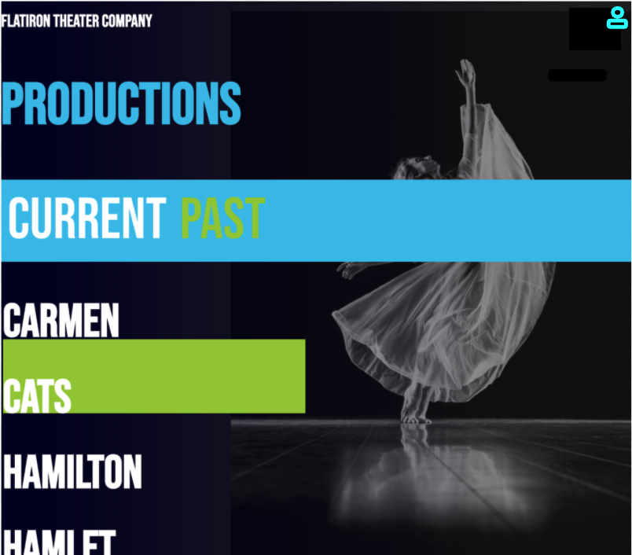

# Phase-2-Active Model Serializer

## SWBAT
- [ ] Understand the purpose of a serializer in a JSON API application 
- [ ] Configure ActiveModel::Serializer with a single model
- [ ] Serialize nested data using has_many and belongs_to
- [ ] Serialize Custom Methods


### What are we making?


### The backend
* Should have 2 models 
* CrewMembers > Productions


**Routs**  
`GET /Productions :` Should return a collection of cats  
`GET /Productions/:id` Should return a single production
`POST /Productions :` Creates a production   
`PUT /Productions/:id` Updates a production  
`Delete /Productions/:id` Destroys a production  

### Request Response Cycle 


### Serializer 
ActiveModel::Serializer allows us to format our json so we can send custom and nested data to our frontend. It allows our controllers to remain clean while handling the serialization in a special separate class.  

To use it, we must first add it to your gem file `gem 'active_model_serializers'` 

We now have a new rails generator that will create a new Serializer for us. `rails g serializer production`
> Note: the serializer must be singular 

We can configure our Serializer to have as many or as few attributes as we want. 
```
#production_serializer.rb
class ProductionSerializer < ActiveModel::Serializer
  attributes :id, :title, :genre, :budget, :image, :director, :ongoing, :description, :performers_and_roles

end

# Our controller can now be free of only or except
#production_controller.rb
  def show
        production = Production.find_by(id: params[:id])
        render json: production
  end 
```

### has_many belongs_to
Our Serializer can be configured to include it a one-to-many relationship.
Both models will need a serializer, and the relationship will need to be added to both.

```
class ProductionSerializer < ActiveModel::Serializer
  attributes :id, :title, :genre, :budget, :image, :director, :ongoing, :description, :performers_and_roles
  has_many :crew_members

end

class CrewMemberSerializer < ActiveModel::Serializer
  attributes :id, :name, :job_title
  belongs_to :production
end

```

### Custom methods
ActiveModel::Serializer lets create custom methods that return data as additional attributes.
We can define a method inside the Serializer and add it to out attributes.

In this example I used performers_and_roles to customize a return for my many-to-many relationship.    
>Note: In order to access attributes in the serializer we need to chain 'object' to self. 

```
class ProductionSerializer < ActiveModel::Serializer
  attributes :id, :title, :genre, :budget, :image, :director, :ongoing, :description, :performers_and_roles
  has_many :crew_members

  def performers_and_roles
    self.object.character_roles.map{|cr| "#{cr.role} : #{cr.performer.name}"}
  end
end


```