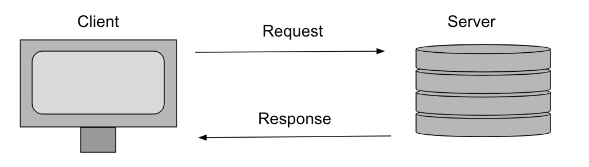

# Phase-2 Authenticating Users

## SWBAT

- [ ] Define the term "authentication"
- [ ] Understand how websites use login to authenticate users

### What are we making?

### The backend
* Should have 2 models 
* CrewMembers > Productions

**Routs**  
`GET /Productions :` Should return a collection of cats  
`GET /Productions/:id` Should return a single production
`POST /Productions :` Creates a production   
`PUT /Productions/:id` Updates a production  
`Delete /Productions/:id` Destroys a production  

### Request Response Cycle 

### Bcrypt